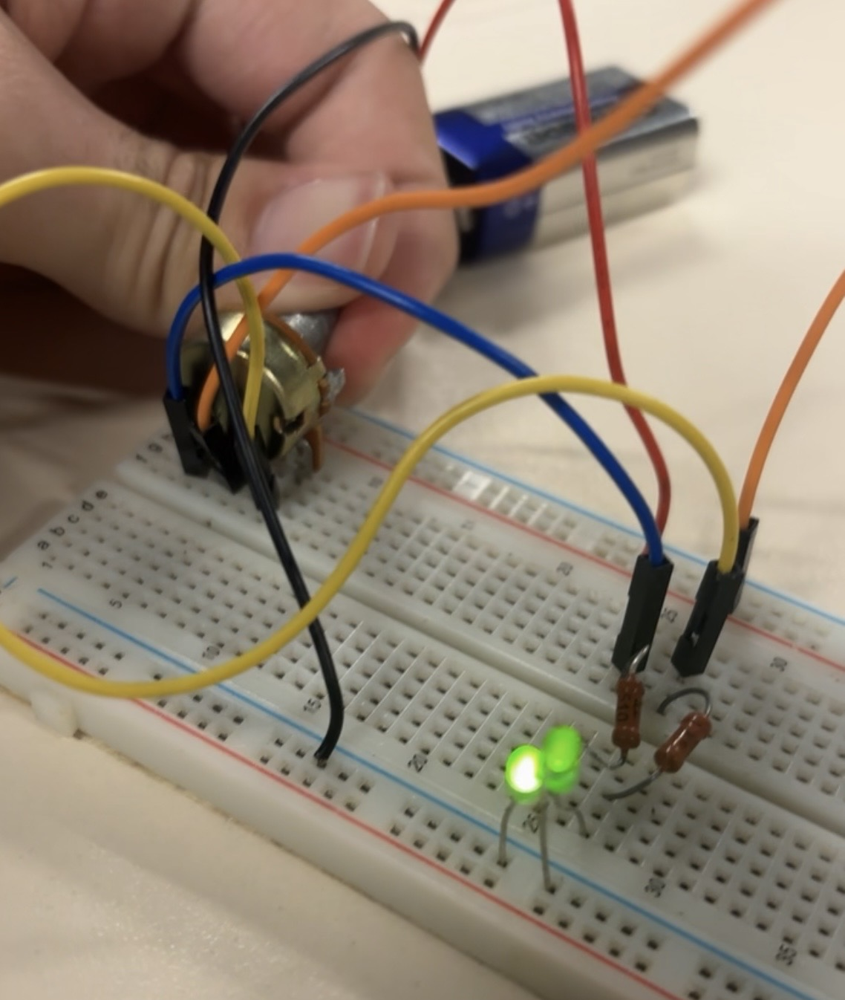

# Dual LED Circuit with Potentiometer

## Description
This circuit demonstrates how two LEDs are connected using resistors and a potentiometer (variable resistor) to control the current and brightness. The circuit is powered by a battery and built on a breadboard.

## Components
•⁠  ⁠2 LEDs
•⁠  ⁠Resistors
•⁠  ⁠Potentiometer (variable resistor)
•⁠  ⁠Battery
•⁠  ⁠Breadboard
•⁠  ⁠Wires

## What I Learned
•⁠  ⁠How to connect multiple LEDs in one circuit
•⁠  ⁠How a potentiometer can control brightness
•⁠  ⁠Importance of resistors for protecting LEDs
•⁠  ⁠Better understanding of current flow in more complex circuits

## Circuit Image

